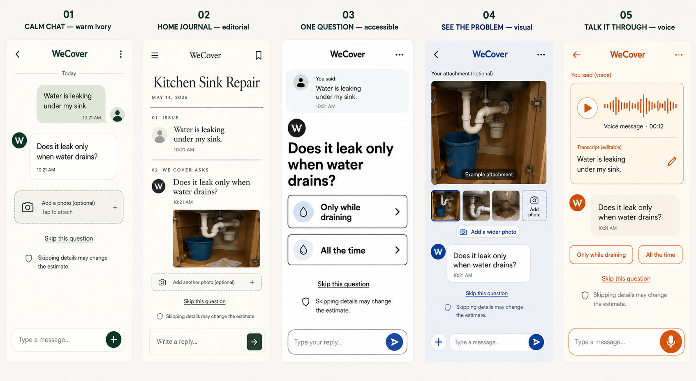
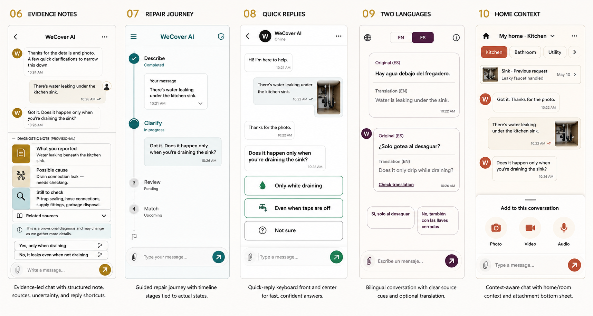

# WeCover UI/UX 시안 비교

2026-09-05 · 선호: 편안하고 신뢰감 있게 · 모바일 앱 중심 · 승인 전 시안

실제 앱 화면과 빌드는 변경하지 않았습니다. 아래 이미지는 생성된 디자인 방향 시안이며, 샘플 사진·파형·이력·날짜는 실제 이용 기록이나 구현 완료의 증거가 아닙니다. 구현 시에는 실제 상태와 데이터만 표시합니다.

| 번호 | 핵심 콘셉트 | 주요 사용자 | 장점 | 주의점 |
|---|---|---|---|---|
| 01 | 편안한 대화 집중 | 처음 이용하는 일반 고객 | 익숙하고 시작이 쉬움 | 근거 설명은 쉽게 펼칠 수 있어야 함 |
| 02 | 수리 기록 수첩 | 기록을 차분히 읽는 고객 | 상담 내역 정리가 쉬움 | 긴 기록이 읽기 부담이 될 수 있음 |
| 03 | 한 질문씩 큰 안내 | 비숙련·큰 글씨 선호 고객 | 다음 행동이 명확함 | 질문 단계를 불필요하게 늘리지 않기 |
| 04 | 사진 중심 대화 | 눈에 보이는 고장을 설명하는 고객 | 사진과 질문을 함께 보기 쉬움 | 사진 없는 상담도 가능해야 함 |
| 05 | 음성 중심 대화 | 타이핑이 불편한 고객 | 말로 증상을 설명하기 편함 | 소음·개인정보·오인식 수정 고려 |
| 06 | 근거를 보여주는 진단 노트 | 원인 추정 이유가 궁금한 고객 | 관찰과 추정을 구분해 신뢰 형성 | 확정 진단처럼 보이지 않게 하기 |
| 07 | 진행 상태 타임라인 | 상담 이후 과정이 궁금한 고객 | 현재와 다음 단계를 알기 쉬움 | 추가 질문으로 되돌아가는 흐름 허용 |
| 08 | 빠른 답변 선택 | 짧게 답하고 싶은 고객 | 한 손으로 빠르게 답변 | 선택지 밖의 자유 답변 유지 |
| 09 | 두 언어 비교 대화 | 영어·스페인어를 함께 쓰는 고객 | 원문·번역 확인이 쉬움 | 번역을 상시 펼치면 화면이 길어짐 |
| 10 | 집·공간 맥락 대화 | 반복 이용하는 집주인 | 이전 상담 맥락 재사용 | 첫 이용 시 집 등록을 강요하지 않기 |

## 추천

01번을 기본 방향으로 추천합니다. 따뜻한 중립 배경, 짙은 녹색 강조, 넉넉한 대화 간격으로 구성합니다. 사진·영상·음성은 입력창의 첨부 메뉴에 모으고, 상단은 제목과 더보기, 하단은 상담·내 요청·계정으로 단순화합니다. 출처는 원인 추정 아래 펼쳐볼 수 있게 유지합니다.

## 공통 개선 기준

- 채팅과 다음 질문을 가장 먼저 읽을 수 있게 한다.
- 첨부와 번역은 필요한 위치에서 연다. 기존 기능을 삭제하지 않는다.
- 선택 질문은 질문 옆에서 건너뛰되, 견적 영향 안내와 동의를 유지한다.
- 안전 필수 질문 및 긴급 안내는 축소·숨김 처리하지 않는다.
- 원인 후보와 확정 진단을 구분한다. 근거·출처는 접근 가능하게 둔다.
- 접수 완료 후 내 요청으로 바로 이동한다. 실제 저장·업로드·매칭 상태만 보여준다.
- 넓은 웹 화면에서도 대화의 읽기 폭을 제한하고, 영어·스페인어 길이 차이를 검증한다.

## 참고 근거

- [Apple: Generative AI](https://developer.apple.com/design/human-interface-guidelines/generative-ai) — 생성 결과의 불확실성과 대기 상태를 설명한다.
- [Apple: Tab bars](https://developer.apple.com/design/human-interface-guidelines/tab-bars) — 자주 사용하는 목적지 위주로 탭을 구성한다.
- [Material: Bottom sheets](https://github.com/material-components/material-components-android/blob/master/docs/components/BottomSheet.md) — 첨부처럼 보조 선택지를 필요할 때 연다.
- [WCAG: Reflow](https://www.w3.org/WAI/WCAG22/Understanding/reflow.html) — 좁은 화면과 확대 상태의 읽기 흐름을 확인한다.

다음 단계: 시안 선택 → 실제 화면 구현 → 새 캡처와 첨부·질문·건너뛰기·접수 기능 검사.
